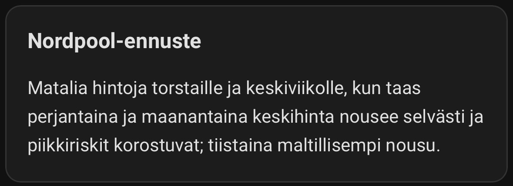
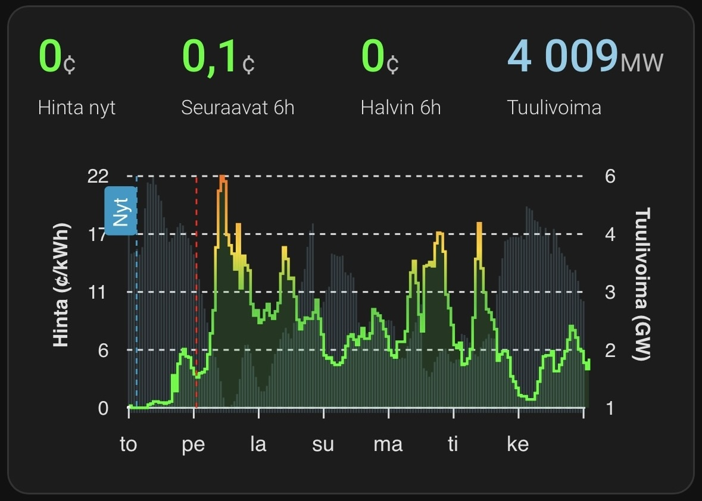
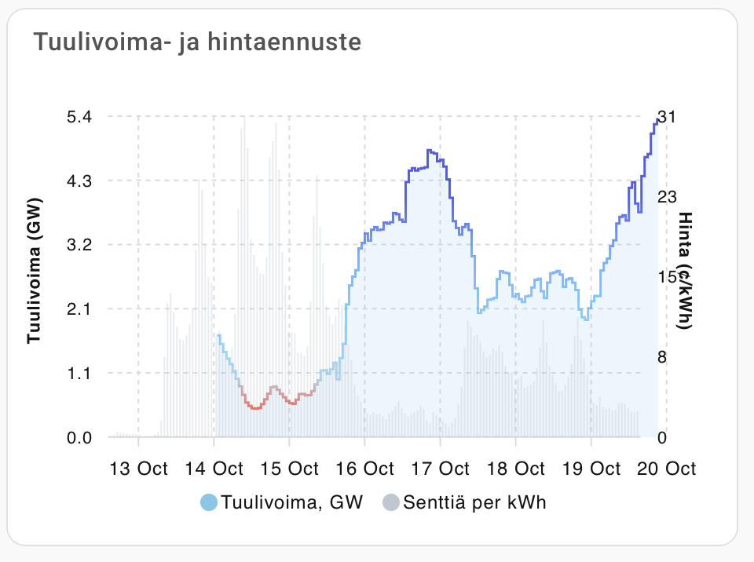
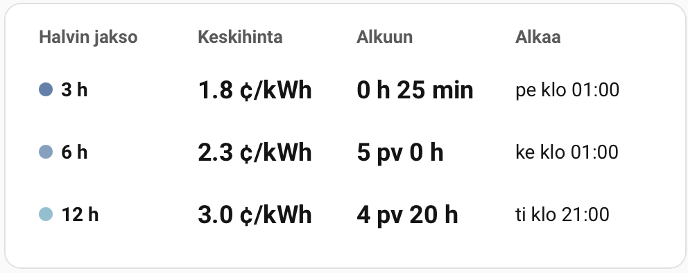

# Nordpool Predict FI – Home Assistant Integration

**Nordpool Predict FI is a Home Assistant integration that displays the forecasts published by [`vividfog/nordpool-predict-fi`](https://github.com/vividfog/nordpool-predict-fi). It reads the hourly price feed (`prediction.json`) and the wind forecast (`windpower.json`), then exposes the data as sensors.**

The integration shows all available data from today (Helsinki time) onwards. Price data combines [Sähkötin](https://sahkotin.fi/hours) realized prices with forecast data, transitioning from actual to predicted values. Wind power data is shown similarly.

Cheapest windows evaluate every hour from today’s Helsinki midnight onward, blending realized and forecast data to highlight the lowest-priced future blocks throughout the week.

All reported price states already include VAT as provided by Nordpool Predict FI.

---

## Sensors

| Entity | Type | Description |
| --- | --- | --- |
| `sensor.nordpool_predict_fi_price` | Sensor | Continuous hourly price timeline (`c/kWh`) built from Sähkötin realizations + Nordpool Predict forecasts. |
| `sensor.nordpool_predict_fi_price_now` | Sensor | Latest price value at or before the current hour, plus the timestamp it originated from. |
| `sensor.nordpool_predict_fi_price_daily_average` | Sensor | Average price across all full Helsinki days currently available; attributes include per-day breakdowns plus `daily_average_span_start`/`daily_average_span_end` to mark the aggregated window. |
| `sensor.nordpool_predict_fi_price_next_1h` | Sensor | Average price for the next starting 1 hour. |
| `sensor.nordpool_predict_fi_price_next_3h` | Sensor | Average price for the next 3 hours. |
| `sensor.nordpool_predict_fi_price_next_6h` | Sensor | Average price for the next 6 hours. |
| `sensor.nordpool_predict_fi_price_next_12h` | Sensor | Average price for the next 12 hours. |
| `number.nordpool_predict_fi_extra_fees` | Number | Adjustable surcharge (c/kWh) that is added to every price reading; defaults to 0.0. |
| `number.nordpool_predict_fi_cheapest_window_lookahead_hours` | Number | Shared forward horizon (1–168, default 168) that bounds all fixed cheapest window searches; windows must end before this horizon. |
| `number.nordpool_predict_fi_custom_window_hours` | Number | Duration in hours scanned by the customizable cheapest window sensor (1–24, default 4). |
| `number.nordpool_predict_fi_custom_window_start_hour` | Number | First Helsinki hour (0–23) included when searching for the custom cheapest window. |
| `number.nordpool_predict_fi_custom_window_end_hour` | Number | Last Helsinki hour (0–23) included when searching for the custom cheapest window; wrap around midnight by setting the end earlier than the start. |
| `number.nordpool_predict_fi_custom_window_lookahead_hours` | Number | Forward horizon in hours (1–168, default 72) used when scanning for the custom cheapest window; candidate windows must finish before this horizon ends. |
| `sensor.nordpool_predict_fi_windpower` | Optional sensor | Wind production forecast (MW) with the complete forecast series. |
| `sensor.nordpool_predict_fi_windpower_now` | Optional sensor | Wind power value for the current hour with its timestamp. |
| `sensor.nordpool_predict_fi_cheapest_3h_price_window` | Sensor | Lowest average of any 3-hour window in the data; attributes expose `window_start`, `window_end`, `window_points`, `window_lookahead_hours`, `window_lookahead_limit`, and `raw_source`. |
| `sensor.nordpool_predict_fi_cheapest_3h_window_active` | Sensor (boolean) | `True` while the selected 3-hour cheapest window is currently in progress; attributes mirror the window metadata including `window_lookahead_hours`. |
| `sensor.nordpool_predict_fi_cheapest_6h_price_window` | Sensor | Same as above for 6-hour windows, useful for longer running appliances. |
| `sensor.nordpool_predict_fi_cheapest_6h_window_active` | Sensor (boolean) | `True` when the 6-hour cheapest window includes the current hour. |
| `sensor.nordpool_predict_fi_cheapest_12h_price_window` | Sensor | Tracks the cheapest 12-hour block for day-level planning. |
| `sensor.nordpool_predict_fi_cheapest_12h_window_active` | Sensor (boolean) | `True` when the 12-hour cheapest block has already started. |
| `sensor.nordpool_predict_fi_cheapest_custom_price_window` | Sensor | Lowest average across the configured custom window; attributes include window metadata, hour mask, custom lookahead settings, and the shared `window_lookahead_hours`. |
| `sensor.nordpool_predict_fi_cheapest_custom_window_active` | Sensor (boolean) | `True` while the custom cheapest window is active. |
| `sensor.nordpool_predict_fi_narration_fi` | Sensor | Finnish narration summary/ingress as the sensor state; the full Markdown lives in `content` with `source_url` pointing at the raw file. |
| `sensor.nordpool_predict_fi_narration_en` | Sensor | English narration equivalent with the same attributes for dashboards or automations. |

All timestamps are UTC ISO8601 strings; Home Assistant handles local conversion based on your instance settings.

Narration sensors expose `language`, `summary` (state), `content` (full Markdown), and `source_url` attributes.

---

## Dashboard Cards

Manual card snippets live in docs — see [`docs/README.md`](docs/README.md) for copy/paste steps. Install [ApexCharts Card](https://github.com/RomRider/apexcharts-card) (and Button Card for the table) before adding them to your dashboard.

### Morning Briefing Summary

[`npf_card_summary_fi.yaml`](docs/npf_card_summary_fi.yaml) and [`npf_card_summary_en.yaml`](docs/npf_card_summary_en.yaml) surface the short-form narrations; pair them with the full Markdown versions (`npf_card_narration_fi.yaml`, `npf_card_narration_en.yaml`) for longer notes.



### Daily Price Averages

[`npf_card_daily_averages_button-card.yaml`](docs/npf_card_daily_averages_button-card.yaml) offers a button-card table layout with weekday labels plus daily min/avg/max columns.

[`npf_card_daily_averages_md.yaml`](docs/npf_card_daily_averages_md.yaml) renders a simple Markdown table of each Helsinki day with average, min, and max prices.

### Price vs. Wind Outlook

[`npf_card_price.yaml`](docs/npf_card_price.yaml) combines realized + forecast prices with wind production so you can spot when generation pulls prices down.



### Wind Production Spotlight

[`npf_card_wind.yaml`](docs/npf_card_wind.yaml) flips the perspective to wind-first while keeping the price trace available for context across the week.



### Cheapest Window Countdown

[`npf_card_cheapest_countdown.yaml`](docs/npf_card_cheapest_countdown.yaml) presents the best 3 h, 6 h, and 12 h windows side by side, using Button Card to keep the layout compact.



---

## Installation (HACS)

1. Open HACS → Integrations → *Custom repositories* → add:
  - `https://github.com/vividfog/nordpool-predict-fi-hacs`
  - `Integration` category
2. Install **Nordpool Predict FI** from HACS and restart Home Assistant.

---

## Configuration Flow

`Settings → Devices & Services → Add Integration → Nordpool Predict FI`

During setup (or later via *Configure*) you can tweak:

- **Base URL** – defaults to `https://raw.githubusercontent.com/vividfog/nordpool-predict-fi/main/deploy`. Point it to another host if you mirror the files.
- **Update interval** – polling frequency in minutes (1–720, default 30).

The host needs tzdata with the `Europe/Helsinki` zone. If that package is missing the coordinator raises an error in the Home Assistant logs.

---

## Working With the Data

- All data (price forecasts, wind power, and realized prices) is shown from beginning of today (Helsinki time) onwards.
- The dedicated extra fees number lets you overlay grid fees or markups in cents per kWh; the value is reflected in price sensor states, cheapest windows, and their `extra_fees` attributes.
- Daily averages sensor keeps a running list of full Helsinki days (00:00-23:00) with their averaged prices and the underlying hourly points for dashboard tables or charts.
- Sähkötin CSV data for the current Helsinki day is merged with Nordpool Predict FI forecasts, so the `forecast` attribute already contains realized + predicted prices in one timeline.
- The price sensor also exposes `forecast_start`, the first forecast hour after realized data, so dashboards can mark where predictions kick in.
- Cheapest windows (3h, 6h, 12h) plus the configurable custom window sweep the merged timeline starting at today’s Helsinki midnight, using realized prices first and forecast points after that; they stay selected while active and advance to the next cheapest upcoming block once finished.
- Custom cheapest window duration and the hour mask (start/end, Helsinki time) are controlled via the three number entities above; masks wrap across midnight when the end hour is earlier than the start.
- All cheapest window calculations are done in the coordinator and exposed both as sensor states (average price) and attributes for automations; matching `*_window_active` sensors flip to `True` when the window currently covers the present hour.

## Data Sources

- Hourly realized prices: [Sähkötin](https://sahkotin.fi/hours)
- Forecast artifacts: [`prediction.json`](https://raw.githubusercontent.com/vividfog/nordpool-predict-fi/main/deploy/prediction.json) and [`windpower.json`](https://raw.githubusercontent.com/vividfog/nordpool-predict-fi/main/deploy/windpower.json)

---

## Troubleshooting

- **No data after install** – verify the Base URL is reachable and serves the JSON files (use your browser or `curl`). Check Supervisor logs for `UpdateFailed` messages.
- **Timestamps look wrong** – the integration reports UTC; Home Assistant handles most conversions but ensure your system time zone is configured correctly.
- **Missing tzdata** – on minimal containers install a tzdata package (`apk add tzdata`, `apt install tzdata`, etc.).

---

## Development

- Python 3.12+ is required.
- Install dev tooling and dependencies:
  ```bash
  uv venv --python 3.12 --seed
  source .venv/bin/activate
  pip install -r requirements-dev.txt
  ```
- Run linters and tests:
  ```bash
  ruff check
  pytest
  ```
- Coordinator tests mock network I/O; sensor tests validate entity wiring. Add tests alongside any new behaviour.
- `scripts/dev_fetch.py` is a helper that downloads the JSON artifacts for local debugging (no Home Assistant required).
- The integration follows Home Assistant async patterns. Avoid blocking calls, keep changes in ASCII, and ensure new features are represented in both documentation and tests.
- `AGENTS.md` is provided for AI-assisted development.
