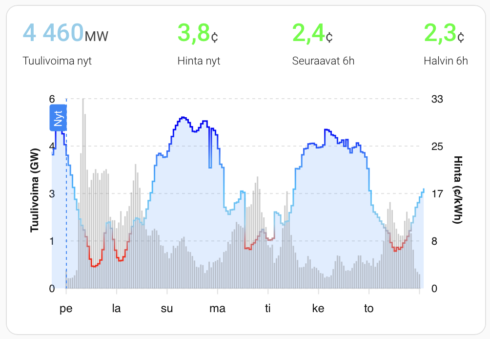

# Nordpool Predict FI – Home Assistant Integration

Nordpool Predict FI is a Home Assistant custom integration that mirrors the forecast data published by [`vividfog/nordpool-predict-fi`](https://github.com/vividfog/nordpool-predict-fi). It fetches the hourly price prediction (`prediction.json`) and optional wind power forecast (`windpower.json`) and makes them available as Home Assistant entities.

> **Release timing:** Nordpool publishes tomorrow’s Finnish spot prices at 14:00 Helsinki time. Until then the integration exposes only the next true predictions (tomorrow 01:00 onward before 14:00, day-after-tomorrow after 14:00). This avoids repeating the already-known prices for the current day.
>
> The same cutoff is applied to the wind power forecast so both series stay aligned.

---

## What You Get

| Entity | Type | Description |
| --- | --- | --- |
| `sensor.nordpool_predict_fi_upcoming_price` | Sensor | Upcoming hourly price (`c/kWh`) with the full forecast and `next_valid_from` timestamp attribute. |
| `sensor.nordpool_predict_fi_upcoming_wind_power` | Optional sensor | Upcoming wind production forecast (MW) with the forecast series and `next_valid_from` attribute. |
| `sensor.nordpool_predict_fi_cheapest_3h_price_window` | Sensor | Lowest average of any 3-hour window ahead; attributes expose `window_start`, `window_end`, `window_points`, and `raw_source`. |
| `sensor.nordpool_predict_fi_cheapest_6h_price_window` | Sensor | Same as above for 6-hour windows, useful for longer running appliances. |
| `sensor.nordpool_predict_fi_cheapest_12h_price_window` | Sensor | Tracks the cheapest 12-hour block for day-level planning. |

All timestamps are UTC ISO8601 strings; Home Assistant handles local conversion based on your instance settings.

---

## Installation (HACS)

1. Open HACS → Integrations → *Custom repositories* → add `https://github.com/vividfog/nordpool-predict-fi-hacs` (`Integration` category).
2. Install **Nordpool Predict FI** from HACS and restart Home Assistant.

---

## Configuration Flow

`Settings → Devices & Services → Add Integration → Nordpool Predict FI`

During setup (or later via *Configure*) you can adjust:

- **Base URL** – defaults to `https://raw.githubusercontent.com/vividfog/nordpool-predict-fi/main/deploy`. Replace it if you host the JSON elsewhere.
- **Update interval** – refresh cadence in minutes (1–720, default 30).
- **Load wind power data** – fetches `windpower.json` and creates the wind sensor.

The integration requires system tzdata that includes `Europe/Helsinki`. If tzdata is missing the coordinator raises an actionable error in the Home Assistant logs.

---

## Working With the Data

- Forecast rows are interpreted as 1-hour steps sorted in ascending time.
- Only future predictions are exposed (trimmed to the next day or day-after-day cutoff described above).
-- The coordinator surfaces the trimmed forecast and next effective timestamp for integrations that need to know when values change.
- Rolling cheapest windows (3h, 6h, 12h) are calculated on the coordinator and surfaced both as sensor states (average price) and attributes you can reference in automations.

## Dashboard Cards

Copy the ready-made ApexCharts cards from the repository root:


- [`npf_card_price.yaml`](npf_card_price.yaml) – combines the price sensor forecast with wind power to highlight how production correlates with price. Requires both `sensor.nordpool_predict_fi_upcoming_price` and `sensor.nordpool_predict_fi_upcoming_wind_power`.
- [`npf_card_wind.yaml`](npf_card_wind.yaml) – focuses on wind output with price as supporting data over a week.


Paste the YAML into the Raw Configuration Editor of a Lovelace dashboard that has [ApexCharts Card](https://github.com/RomRider/apexcharts-card) installed. Adjust entity IDs if you renamed sensors. The cards rely on forecast attributes exposed by the price and wind sensors.

---

## Troubleshooting

- **No data after install** – verify the Base URL is reachable and serves the JSON files (use your browser or `curl`). Check Supervisor logs for `UpdateFailed` messages.
- **Timestamps look wrong** – the integration reports UTC; Home Assistant handles most conversions but ensure your system time zone is configured correctly.
- **Missing tzdata** – on minimal containers install a tzdata package (`apk add tzdata`, `apt install tzdata`, etc.).

---

## Development

- Python 3.12+ is required.
- Install dev tooling and dependencies:
  ```bash
  uv venv --python 3.12 --seed
  source .venv/bin/activate
  pip install -r requirements-dev.txt
  ```
- Run linters and tests:
  ```bash
  ruff check
  pytest
  ```
- Coordinator tests mock network I/O; sensor tests validate entity wiring. Add tests alongside any new behaviour.
- `scripts/dev_fetch.py` is a helper that downloads the JSON artifacts for local debugging (no Home Assistant required).

The integration follows Home Assistant async patterns. Avoid blocking calls, keep changes in ASCII, and ensure new features are represented in both documentation and tests.
