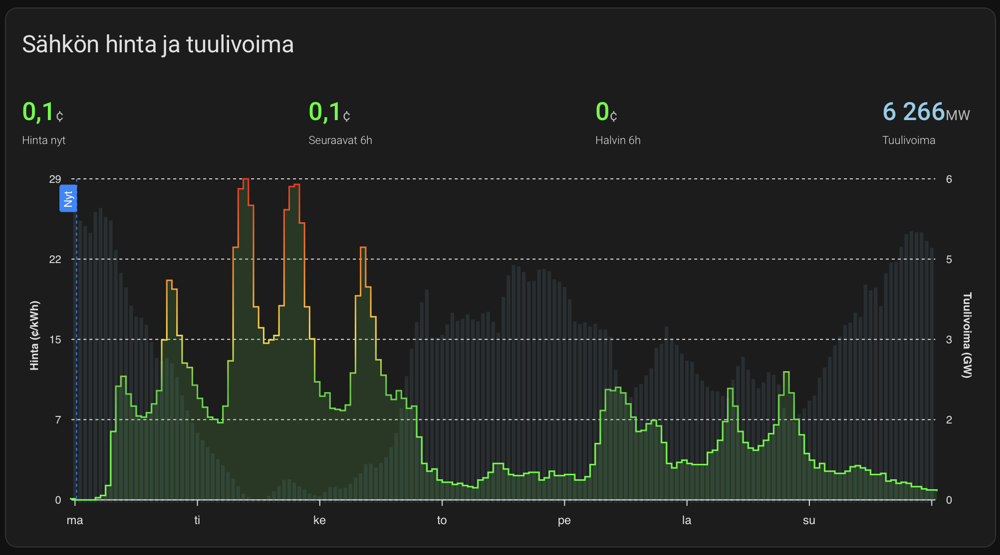

# Lovelace examples

The integration exposes sensors that let you overlay upstream predictions on top of official Nordpool data. Below is a minimal example using the [ApexCharts card](https://github.com/RomRider/apexcharts-card) recommended in the upstream project.



```yaml
type: custom:apexcharts-card
header:
  show: true
  title: Nordpool FI – forecast vs. market
graph_span: 7d
span:
  start: day
series:
  - entity: sensor.nordpool_predict_fi_price
    name: Predicted price
    float_precision: 2
    data_generator: |
      return entity.attributes.forecast.map(item => [item.timestamp, item.value]);
  - entity: sensor.nordpool_kwh_fi_eur_2_10_0  # replace with your Nordpool market sensor
    name: Market price
    float_precision: 2
    type: line
yaxis:
  - decimals: 2
    min: 0
    apex_config:
      title:
        text: "c/kWh"
```

If you enable the optional wind power dataset, you can chart it on a secondary axis:


```yaml
- entity: sensor.nordpool_predict_fi_windpower
  name: Wind power forecast
  unit: MW
  curve: smooth
  stroke_width: 1
  offset: 0
  yaxis_id: wind
  data_generator: |
    return entity.attributes.windpower_forecast.map(item => [item.timestamp, item.value]);

yaxis:
  - id: price
    decimals: 2
    apex_config:
      title:
        text: "c/kWh"
  - id: wind
    opposite: true
    apex_config:
      title:
        text: "MW"
```

Because the integration keeps the raw GitHub URL in the sensor attributes (`raw_source`), it is easy to point template sensors or automations to alternative mirrors if you ever move the data off GitHub Pages.
